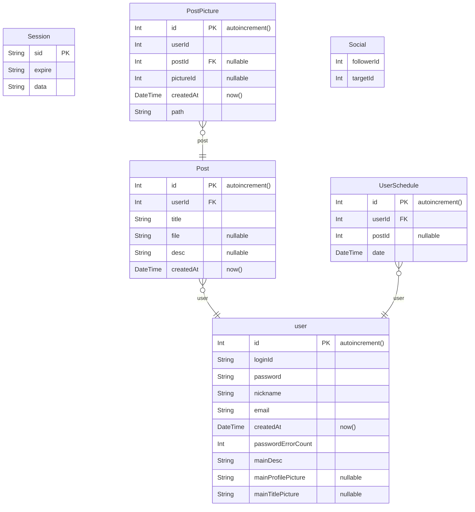

```mermaid
erDiagram
	Session {
		String sid PK
		String expire
		String data
	}
	user {
		Int id PK  "autoincrement()"
		String loginId
		String password
		String nickname
		String email
		DateTime createdAt  "now()"
		Int passwordErrorCount
		String mainDesc
		String mainProfilePicture  "nullable"
		String mainTitlePicture  "nullable"
	}
	Post {
		Int id PK  "autoincrement()"
		Int userId FK
		String title
		String file  "nullable"
		String desc  "nullable"
		DateTime createdAt  "now()"
	}
	PostPicture {
		Int id PK  "autoincrement()"
		Int userId
		Int postId FK  "nullable"
		Int pictureId  "nullable"
		DateTime createdAt  "now()"
		String path
	}
	UserSchedule {
		Int id PK  "autoincrement()"
		Int userId FK
		Int postId  "nullable"
		DateTime date
	}
	Social {
		Int followerId
		Int targetId
	}
	Post }o--|| user : user
	PostPicture }o--|| Post : post
	UserSchedule }o--|| user : user

```
