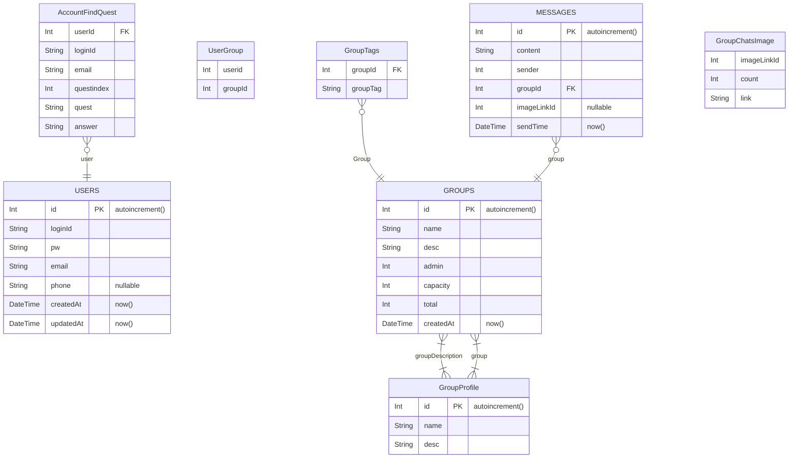

```mermaid
erDiagram
	USERS {
		Int id PK  "autoincrement()"
		String loginId
		String pw
		String email
		String phone  "nullable"
		DateTime createdAt  "now()"
		DateTime updatedAt  "now()"
	}
	AccountFindQuest {
		Int userId FK
		String loginId
		String email
		Int questindex
		String quest
		String answer
	}
	UserGroup {
		Int userid
		Int groupId
	}
	GROUPS {
		Int id PK  "autoincrement()"
		String name
		String desc
		Int admin
		Int capacity
		Int total
		DateTime createdAt  "now()"
	}
	GroupTags {
		Int groupId FK
		String groupTag
	}
	MESSAGES {
		Int id PK  "autoincrement()"
		String content
		Int sender
		Int groupId FK
		Int imageLinkId  "nullable"
		DateTime sendTime  "now()"
	}
	GroupProfile {
		Int id PK  "autoincrement()"
		String name
		String desc
	}
	GroupChatsImage {
		Int imageLinkId
		Int count
		String link
	}
	AccountFindQuest }o--|| USERS : user
	GROUPS }|--|{ GroupProfile : groupDescription
	GroupTags }o--|| GROUPS : Group
	MESSAGES }o--|| GROUPS : group
	GroupProfile }|--|{ GROUPS : group

```
