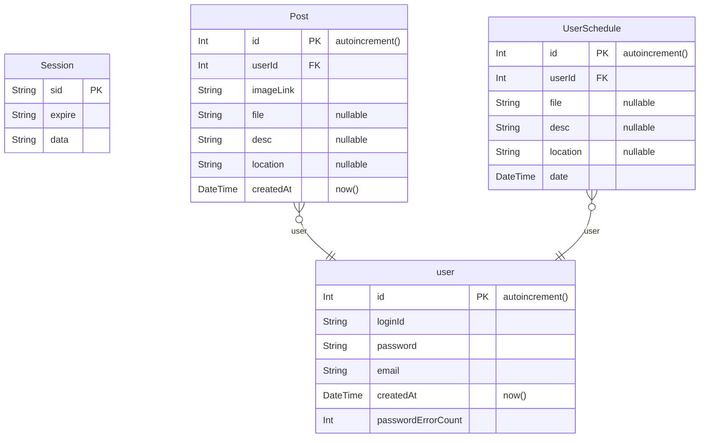

```mermaid
erDiagram
	Session {
		String sid PK
		String expire
		String data
	}
	user {
		Int id PK  "autoincrement()"
		String loginId
		String password
		String email
		DateTime createdAt  "now()"
		Int passwordErrorCount
	}
	Post {
		Int id PK  "autoincrement()"
		Int userId FK
		String imageLink
		String file  "nullable"
		String desc  "nullable"
		String location  "nullable"
		DateTime createdAt  "now()"
	}
	UserSchedule {
		Int id PK  "autoincrement()"
		Int userId FK
		String file  "nullable"
		String desc  "nullable"
		String location  "nullable"
		DateTime date
	}
	Post }o--|| user : user
	UserSchedule }o--|| user : user

```
